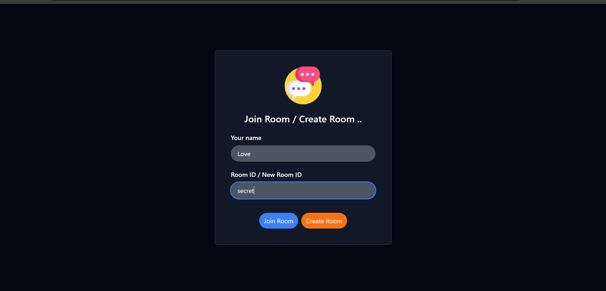
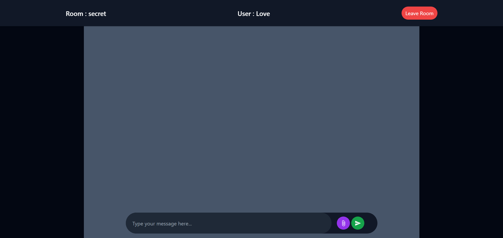
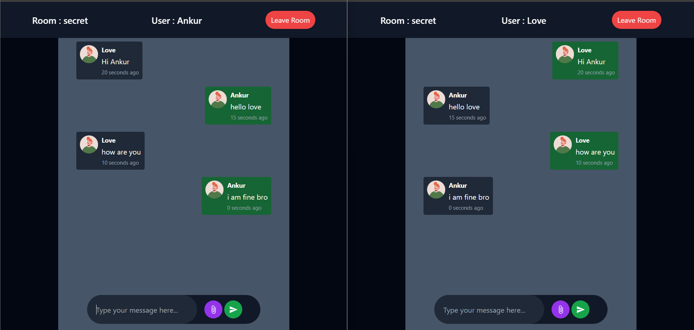

# Real-Time-Chat-Room
Full-Stack Chat-Room Application using Springboot, React, Websocket and Mysql

## 🖥️ Tech Stack
**Frontend:**

&nbsp;
&nbsp;
&nbsp;
&nbsp;

**Backend:**

&nbsp;
&nbsp;

**Realtime Communication:**

**Cloud Storage:**
[Cloudinary](https://cloudinary.com/)

## 🚀 Features
**Messaging System**
- 🔍 Users Create or Join Rooms By Entering Room ID
- 📝 Seamless Creation of New Chat Rooms
- 💬 Real-Time Messaging Between Users

## Sneak Peek of Project 🙈 :

<table>
  <tr>
    <td></td>
    <td></td>
  </tr>
</table>

<h2>📬 Contact</h2>

Feel free to reach me through the below handles if you'd like to contact me.

